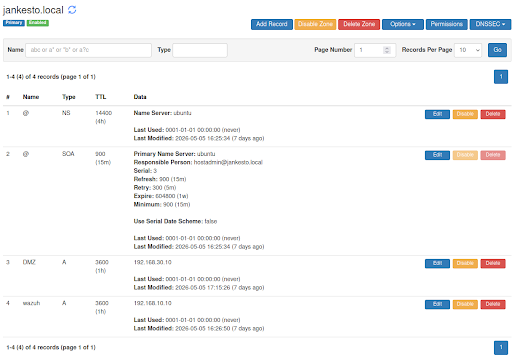
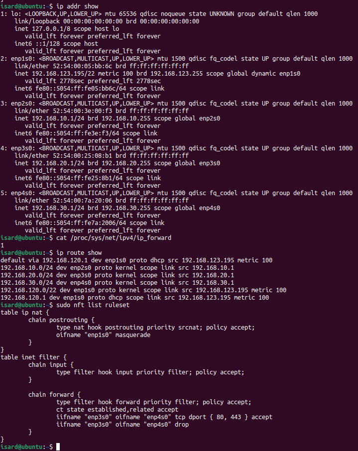

# Configuración Ubuntu Router

## Información General

| Campo | Detalle |
|---|---|
| **VM** | `ubuntu-router` |
| **SO** | Ubuntu Server 22.04 LTS |
| **RAM** | 4 GB |
| **vCPUs** | 2 |
| **Rol** | Router + Firewall (nftables) + DHCP + DNS (Technitium) + Suricata IDS |

---

## Interfaces de Red

| Interfaz | Red IsardVDI | Subred | IP | Rol |
|---|---|---|---|---|
| `enp1s0` | Default | WAN | DHCP (internet) | Salida a internet |
| `enp2s0` | ASIXc2-ITB5a | Gestión | `192.168.10.1/24` | Gateway Gestión |
| `enp3s0` | ASIXc2-ITB6a | Usuarios | `192.168.20.1/24` | Gateway Usuarios |
| `enp4s0` | ASIXc2-ITB7a | DMZ/IoT | `192.168.30.1/24` | Gateway DMZ |

---

## Netplan — `/etc/netplan/00-installer-config.yaml`

```yaml
network:
  version: 2
  ethernets:

    # WAN — Default (internet)
    enp1s0:
      dhcp4: true

    # Gestión — ASIXc2-ITB5a
    enp2s0:
      addresses:
        - 192.168.10.1/24
      dhcp4: false

    # Usuarios — ASIXc2-ITB6a
    enp3s0:
      addresses:
        - 192.168.20.1/24
      dhcp4: false

    # DMZ/IoT — ASIXc2-ITB7a
    enp4s0:
      addresses:
        - 192.168.30.1/24
      dhcp4: false
```

---

## IP Forwarding — `/etc/sysctl.conf`

```bash
# Activar enrutamiento entre interfaces
net.ipv4.ip_forward=1
```

Aplicar:
```bash
sudo sysctl -p
```

---

## DHCP — isc-dhcp-server

### Instalación

```bash
sudo apt update
sudo apt install isc-dhcp-server -y
```

### Interfaces de escucha — `/etc/default/isc-dhcp-server`

```bash
INTERFACESv4="enp2s0 enp3s0 enp4s0"
```

### Configuración — `/etc/dhcp/dhcpd.conf`

```bash
# Configuración global
authoritative;
default-lease-time 600;
max-lease-time 7200;

option domain-name "jankesto.local";
option domain-search "jankesto.local";

# Subred Gestión
subnet 192.168.10.0 netmask 255.255.255.0 {
  option routers 192.168.10.1;
  option domain-name-servers 192.168.10.1;

  # Reserva wazuh-server
  host servidor_wazuh {
    hardware ethernet 52:54:00:01:56:1a;
    fixed-address 192.168.10.10;
  }

  # Reserva admin-server
  host admin_server {
    hardware ethernet 52:54:00:01:42:c5;
    fixed-address 192.168.10.20;
  }
}

# Subred Usuarios
subnet 192.168.20.0 netmask 255.255.255.0 {
  range 192.168.20.100 192.168.20.200;
  option routers 192.168.20.1;
  option domain-name-servers 192.168.20.1;
}

# Subred DMZ
subnet 192.168.30.0 netmask 255.255.255.0 {
  option routers 192.168.30.1;
  option domain-name-servers 192.168.30.1;

  # Reserva dmz-host1
  host servidor-web-dmz1 {
    hardware ethernet 52:54:00:02:ee:b8;
    fixed-address 192.168.30.10;
  }

  # Reserva dmz-db-server
  host servidor-web-dmz2 {
    hardware ethernet 52:54:00:02:33:9e;
    fixed-address 192.168.30.20;
  }
}
```

### Activar servicio

```bash
sudo systemctl restart isc-dhcp-server
sudo systemctl enable isc-dhcp-server
sudo systemctl status isc-dhcp-server
```

### Reservas MAC

| VM | MAC | IP reservada | Subred |
|---|---|---|---|
| `wazuh-server` | `52:54:00:01:56:1a` | `192.168.10.10` | Gestión |
| `admin-server` | `52:54:00:01:42:c5` | `192.168.10.20` | Gestión |
| `dmz-host1` | `52:54:00:02:ee:b8` | `192.168.30.10` | DMZ |
| `dmz-db-server` | `52:54:00:02:33:9e` | `192.168.30.20` | DMZ |

---

## Firewall y NAT con nftables — `/etc/nftables.conf`

```bash
#!/usr/sbin/nft -f

flush ruleset

define IF_WAN    = "enp1s0"
define NET_WAZUH = 192.168.10.0/24
define NET_USERS = 192.168.20.0/24
define NET_DMZ   = 192.168.30.0/24
define WAZUH_IP  = 192.168.10.10
define DMZ_WEB   = 192.168.30.10
define ADMIN_IP  = 192.168.10.20
define MGMT_TCP  = { 22, 80, 443, 5380 }

table inet filter {
    chain input {
        type filter hook input priority 0; policy drop;

        ct state established,related accept
        ct state invalid drop
        iif "lo" accept

        # Solo admin-server puede acceder a servicios de gestión del router
        ip saddr $ADMIN_IP tcp dport $MGMT_TCP accept

        # DNS para todas las subredes
        ip saddr $NET_WAZUH udp dport 53 accept
        ip saddr $NET_WAZUH tcp dport 53 accept
        ip saddr $NET_USERS udp dport 53 accept
        ip saddr $NET_USERS tcp dport 53 accept
        ip saddr $NET_DMZ   udp dport 53 accept
        ip saddr $NET_DMZ   tcp dport 53 accept
    }

    chain forward {
        type filter hook forward priority 0; policy drop;

        ct state established,related accept
        ct state invalid drop

        # Usuarios → DMZ: solo web
        ip saddr $NET_USERS ip daddr $DMZ_WEB tcp dport { 80, 443 } accept

        # Gestión → DMZ: web + SSH
        ip saddr $NET_WAZUH ip daddr $DMZ_WEB tcp dport { 22, 80, 443 } accept

        # Usuarios → Wazuh: puertos agente
        ip saddr $NET_USERS ip daddr $WAZUH_IP tcp dport { 1514, 1515, 55000 } accept

        # DMZ → Wazuh: puertos agente
        ip saddr $NET_DMZ   ip daddr $WAZUH_IP tcp dport { 1514, 1515, 55000 } accept

        # Todas las subredes → Internet
        ip saddr $NET_USERS oifname $IF_WAN accept
        ip saddr $NET_DMZ   oifname $IF_WAN accept
        ip saddr $NET_WAZUH oifname $IF_WAN accept
    }
}

table ip nat {
    chain postrouting {
        type nat hook postrouting priority 100;
        oifname $IF_WAN masquerade
    }
}
```

Activar y habilitar en el arranque:
```bash
sudo systemctl enable nftables
sudo systemctl start nftables
```

### Resumen de política de firewall

| Origen | Destino | Puertos permitidos |
|---|---|---|
| `admin-server` | Router (input) | 22, 80, 443, 5380 |
| Todas las subredes | Router (DNS) | 53 TCP/UDP |
| Usuarios | DMZ (`192.168.30.10`) | 80, 443 |
| Gestión | DMZ (`192.168.30.10`) | 22, 80, 443 |
| Usuarios / DMZ | Wazuh (`192.168.10.10`) | 1514, 1515, 55000 |
| Todas las subredes | Internet (WAN) | Todo |

---

## DNS — Technitium DNS Server

### Instalación

```bash
curl -sSL https://download.technitium.com/dns/install.sh | sudo bash
```

Acceso al panel web: `http://192.168.10.1:5380`

### Configuración de Forwarders

| Forwarder | Descripción |
|---|---|
| `8.8.8.8` | Google DNS primario |
| `1.1.1.1` | Cloudflare DNS secundario |

### Zona local — `jankesto.local`

| Nombre | Tipo | IP |
|---|---|---|
| `wazuh` | A | `192.168.10.10` |
| `DMZ` | A | `192.168.30.10` |

> Zona interna para resolver nombres de las VMs sin depender de DNS externo.

### Verificación

```bash
ping wazuh.jankesto.local
ping DMZ.jankesto.local
```

**Evidencia de verificación:**



---

## IDS — Suricata

### Instalación

```bash
sudo add-apt-repository ppa:oisf/suricata-stable
sudo apt update
sudo apt install suricata -y
```

### Configuración — `/etc/suricata/suricata.yaml` (extracto)

```yaml
HOME_NET: "[192.168.10.0/24,192.168.20.0/24,192.168.30.0/24]"

default-rule-path: /var/lib/suricata/rules

rule-files:
  - suricata.rules

classification-file: /etc/suricata/classification.config
reference-config-file: /etc/suricata/reference.config
threshold-file: /etc/suricata/threshold.config

af-packet:
  - interface: enp1s0
```

> Suricata monitoriza el tráfico en la interfaz WAN (`enp1s0`).

### Supresión de alertas — `/etc/suricata/threshold.config`

```bash
suppress gen_id 1, sig_id 2200121
```

### Activar servicio

```bash
sudo systemctl restart suricata
sudo systemctl enable suricata
sudo systemctl status suricata
```

### Logs

| Fichero | Contenido |
|---|---|
| `/var/log/suricata/eve.json` | Logs completos en formato JSON (para Wazuh/SIEM) |
| `/var/log/suricata/fast.log` | Alertas en formato legible |

```bash
# Monitorizar alertas en tiempo real
sudo tail -f /var/log/suricata/fast.log

# Ver eventos JSON (usado por Wazuh)
sudo tail -f /var/log/suricata/eve.json
```

---

## Verificación general

```bash
# Comprobar interfaces e IPs
ip addr show

# Comprobar que el routing está activo
cat /proc/sys/net/ipv4/ip_forward  # debe retornar 1

# Comprobar tabla de rutas
ip route show

# Comprobar reglas nftables activas
sudo nft list ruleset

# Comprobar estado de Suricata
sudo systemctl status suricata
```

**Evidencia de verificación:**

