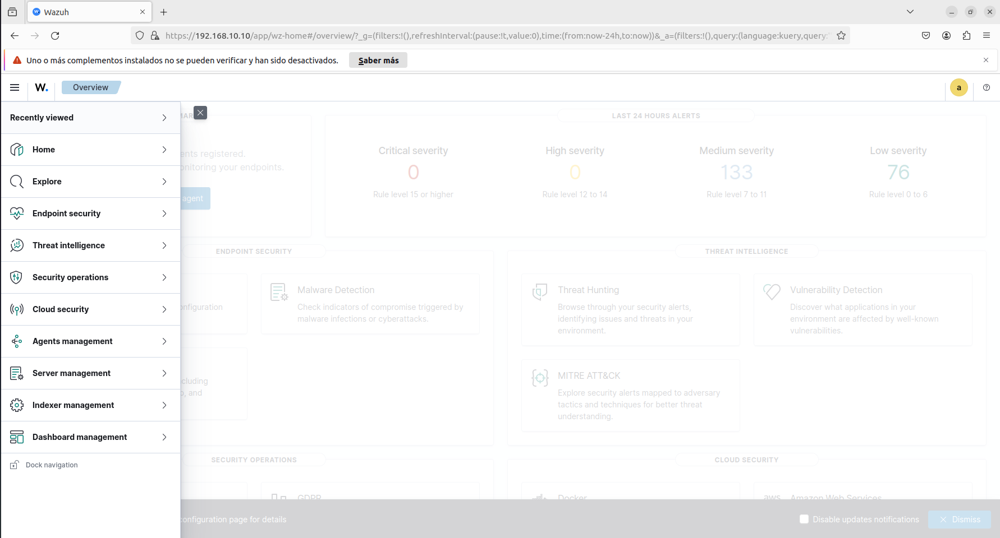
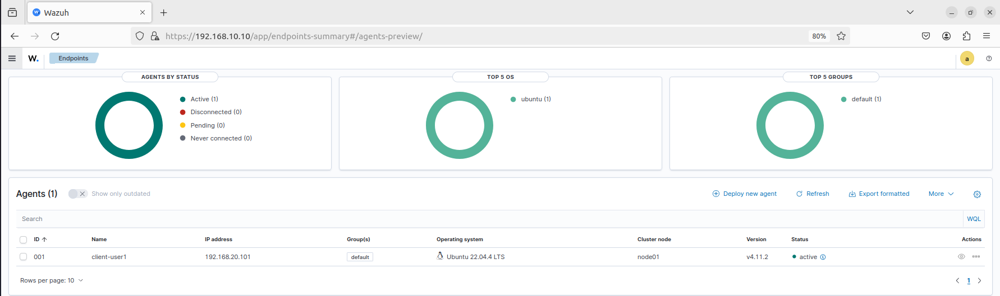
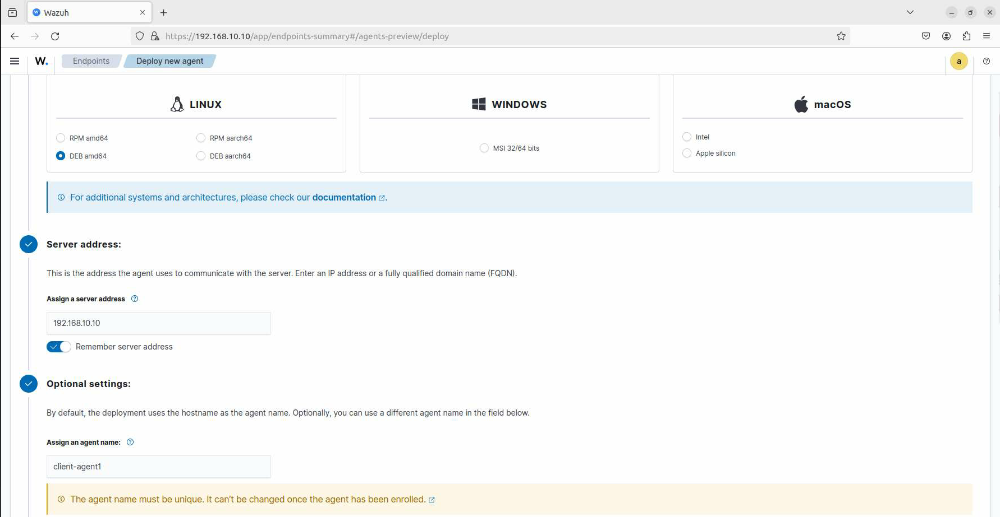
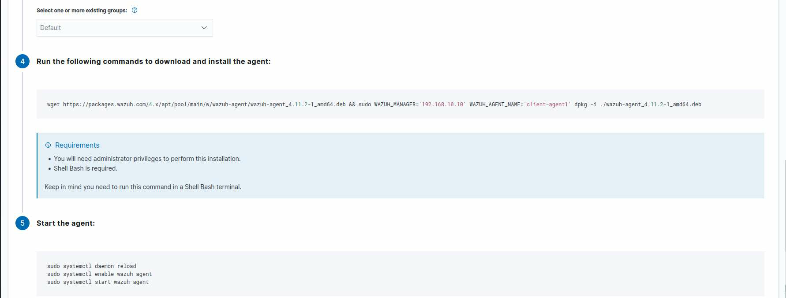
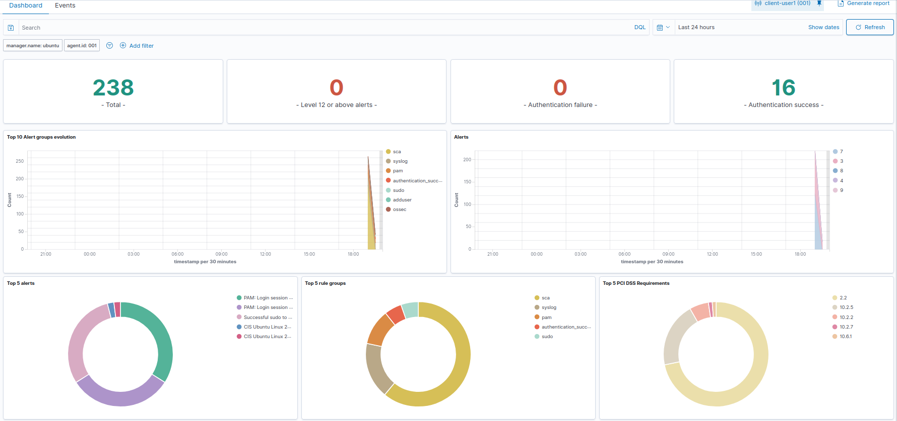

# Configuració Wazuh Server

## Informació General

| Camp | Detall |
|---|---|
| **VM** | `wazuh-server` |
| **SO** | Ubuntu Server 22.04 LTS |
| **RAM** | 4 GB |
| **vCPUs** | 2 |
| **IP** | `192.168.10.10/24` |
| **Versió Wazuh** | 4.11 |
| **Rol** | SOC: Wazuh Manager + Indexer + Dashboard (all-in-one) |

---

## Prerequisits

```bash
sudo apt update
sudo apt install curl apt-transport-https unzip wget -y
```

---

## Instal·lació

### 1. Descarregar scripts oficials

```bash
curl -sO https://packages.wazuh.com/4.11/wazuh-install.sh
curl -sO https://packages.wazuh.com/4.11/config.yml
```

### 2. Configurar nodes — `config.yml`

```yaml
nodes:
  indexer:
    - name: node-1
      ip: 192.168.10.10
  server:
    - name: wazuh-1
      ip: 192.168.10.10
  dashboard:
    - name: dashboard
      ip: 192.168.10.10
```

> Tots els components (Indexer, Manager i Dashboard) s'instal·len a la mateixa VM (all-in-one).

### 3. Generar fitxers de configuració

```bash
sudo bash wazuh-install.sh --generate-config-files
```

### 4. Instal·lació all-in-one

```bash
sudo bash wazuh-install.sh -a
```

---

## Resultat de la instal·lació

INFO: --- Summary ---
INFO: You can access the web interface https://192.168.10.10
User: admin
Password: <REDACTED>
INFO: Installation finished.


> ⚠️ Les credencials s'han guardat de forma segura fora del repositori. Mai pujar contrasenyes reals a GitHub.

---

## Verificació de serveis

```bash
# Comprovar que els 3 serveis estan actius
sudo systemctl status wazuh-manager
sudo systemctl status wazuh-indexer
sudo systemctl status wazuh-dashboard

# Comprovar que el dashboard respon
curl -k https://192.168.10.10
```

**Evidència de verificació:**



### Accés al Dashboard

| Camp | Valor |
|---|---|
| **URL** | `https://192.168.10.10` |
| **Usuari** | `admin` |
| **Contrasenya** | Guardada a `wazuh-passwords.txt` (no al repo) |

---

## Ports utilitzats

| Port | Protocol | Servei |
|---|---|---|
| `443` | HTTPS | Dashboard |
| `1514` | TCP/UDP | Comunicació agents |
| `1515` | TCP | Registre d'agents |
| `9200` | HTTPS | Wazuh Indexer (OpenSearch) |
| `55000` | HTTPS | Wazuh API |

---

## Desplegament d'Agents










### Informació de l'agent

| Camp | Detall |
|---|---|
| **VM** | `client-user1` |
| **SO** | Ubuntu 22.04.4 LTS |
| **IP** | `192.168.20.101` |
| **Nom agent** | `client-user1` |
| **ID agent** | `001` |
| **Grup** | `default` |
| **Versió** | Wazuh v4.11.2 |
| **Estat** | `active` |

### 1. Descarregar i instal·lar l'agent

Des de la VM `client-user1`, executar:

```bash
wget https://packages.wazuh.com/4.x/apt/pool/main/w/wazuh-agent/wazuh-agent_4.11.2-1_amd64.deb \
  && sudo WAZUH_MANAGER='192.168.10.10' \
     WAZUH_AGENT_GROUP='default' \
     WAZUH_AGENT_NAME='client-user1' \
     dpkg -i ./wazuh-agent_4.11.2-1_amd64.deb
```

### 2. Iniciar el servei

```bash
sudo systemctl daemon-reload
sudo systemctl enable wazuh-agent
sudo systemctl start wazuh-agent
```

### 3. Verificar l'estat

```bash
sudo systemctl status wazuh-agent
```

Resultat esperat: `Active: active (running)`

---

## Verificació al Dashboard

Un cop l'agent està actiu, es pot verificar al dashboard:

- **Ruta:** `https://192.168.10.10` → Endpoints → Agents
- L'agent `client-user1` apareix amb estat **active** (verd)
- Node del clúster: `node01`



### Mètriques inicials recollides

| Mòdul | Estat |
|---|---|
| Threat Hunting | ✅ Actiu — 202 events recollits |
| MITRE ATT&CK | ✅ Tàctiques detectades (Defense Evasion, Privilege Escalation, Initial Access) |
| SCA (CIS Ubuntu 22.04 Benchmark v1.0.0) | ✅ Scan completat — 37 passed / 124 failed / Score 22% |
| File Integrity Monitoring (FIM) | ✅ Configurat |
| Vulnerability Detection | ✅ Actiu |

### Exemple d'events generats

Per verificar el funcionament en temps real es van generar els següents events:

```bash
# Creació i eliminació d'usuari (genera alertes de gestió de comptes)
sudo useradd testuser && sudo userdel testuser
```

Resultat: el grup d'alertes `adduser` va aparèixer al dashboard i el comptador d'events va pujar de 193 a 202.