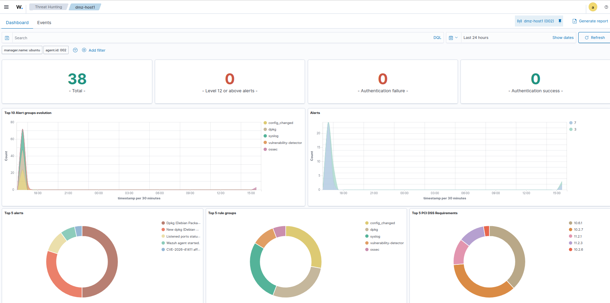
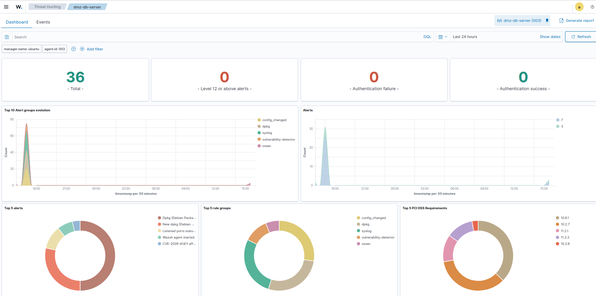
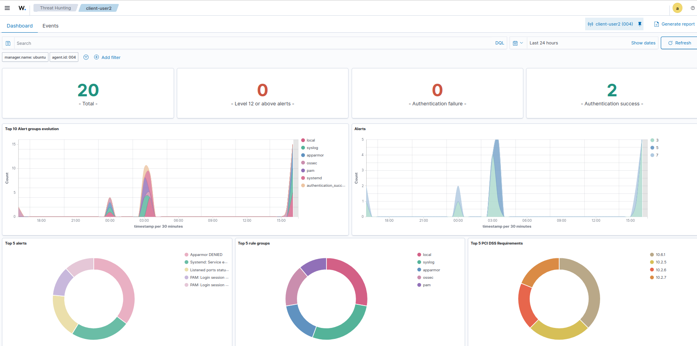
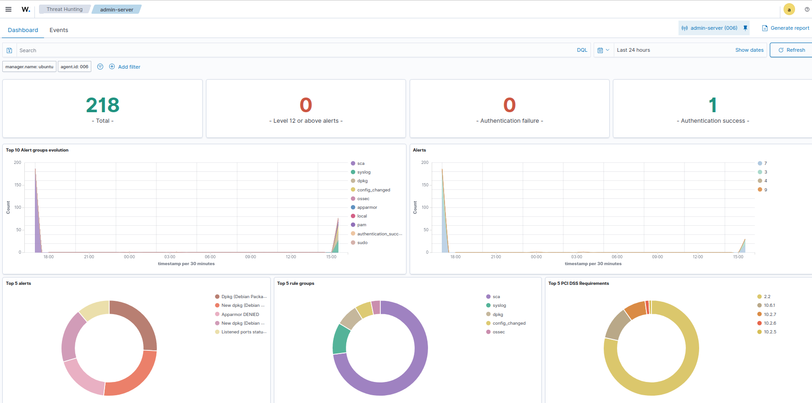

# Configuración Wazuh Server

## Información General

| Campo | Detalle |
|---|---|
| **VM** | `wazuh-server` |
| **SO** | Ubuntu 22.04 LTS |
| **RAM** | 4 GB |
| **vCPUs** | 2 |
| **IP** | `192.168.10.10/24` |
| **Versión Wazuh** | 4.11 |
| **Rol** | SOC: Wazuh Manager + Indexer + Dashboard (all-in-one) |

---

## Prerequisitos

```bash
sudo apt update
sudo apt install curl apt-transport-https unzip wget -y
```

---

## Instalación

### 1. Descargar scripts oficiales

```bash
curl -sO https://packages.wazuh.com/4.11/wazuh-install.sh
curl -sO https://packages.wazuh.com/4.11/config.yml
```

### 2. Configurar nodos — `config.yml`

```yaml
nodes:
  indexer:
    - name: node-1
      ip: 192.168.10.10
  server:
    - name: wazuh-1
      ip: 192.168.10.10
  dashboard:
    - name: dashboard
      ip: 192.168.10.10
```

> Todos los componentes (Indexer, Manager y Dashboard) se instalan en la misma VM (all-in-one).

### 3. Generar ficheros de configuración

```bash
sudo bash wazuh-install.sh --generate-config-files
```

### 4. Instalación all-in-one

```bash
sudo bash wazuh-install.sh -a
```

---

## Resultado de la instalación

INFO: --- Summary ---
INFO: You can access the web interface https://192.168.10.10
User: admin
Password: <REDACTED>
INFO: Installation finished.


> ⚠️ Las credenciales están guardadas de forma segura fuera del repositorio. Nunca subir contraseñas reales a GitHub.

---

## Verificación de servicios

```bash
# Comprobar que los 3 servicios están activos
sudo systemctl status wazuh-manager
sudo systemctl status wazuh-indexer
sudo systemctl status wazuh-dashboard

# Comprobar que el dashboard responde
curl -k https://192.168.10.10
```

**Evidencia de verificación:**


### Acceso al Dashboard

| Campo | Valor |
|---|---|
| **URL** | `https://192.168.10.10` |
| **Usuario** | `admin` |
| **Contraseña** | Guardada en `wazuh-passwords.txt` (no en el repo) |

---

## Puertos utilizados

| Puerto | Protocolo | Servicio |
|---|---|---|
| `443` | HTTPS | Dashboard |
| `1514` | TCP/UDP | Comunicación agentes |
| `1515` | TCP | Registro de agentes |
| `9200` | HTTPS | Wazuh Indexer (OpenSearch) |
| `55000` | HTTPS | Wazuh API |

---

## Automatizaciones

Se han implementado 3 scripts de automatización ubicados en `/usr/local/bin/` y programados mediante `/etc/crontab`. Los scripts se encuentran en la carpeta `scripts/` del repositorio.

### Scripts desplegados

| Script | Descripción | Frecuencia | Log |
|---|---|---|---|
| `wazuh-healthcheck.sh` | Comprueba el estado de los 3 servicios Wazuh y los reinicia automáticamente si caen | Cada 5 min | `/var/log/wazuh-healthcheck.log` |
| `wazuh-agents-report.sh` | Genera un reporte diario con la lista de agentes conectados y desconectados | Diario 08:00 | `/var/log/wazuh-agents-report_<DATE>.txt` |
| `wazuh-backup.sh` | Realiza un backup completo de configuración, reglas, certificados y lista de agentes. Retención de 7 días | Diario 03:00 | `/var/log/wazuh-backup.log` |

### Crontab (`/etc/crontab`)

```bash
*/5 * * * * root /usr/local/bin/wazuh-healthcheck.sh
0 8 * * *   root /usr/local/bin/wazuh-agents-report.sh
0 3 * * *   root /usr/local/bin/wazuh-backup.sh
```

### Instalación de los scripts

```bash
# Copiar scripts al sistema
sudo cp scripts/wazuh-healthcheck.sh   /usr/local/bin/
sudo cp scripts/wazuh-agents-report.sh /usr/local/bin/
sudo cp scripts/wazuh-backup.sh        /usr/local/bin/

# Dar permisos de ejecución
sudo chmod +x /usr/local/bin/wazuh-healthcheck.sh
sudo chmod +x /usr/local/bin/wazuh-agents-report.sh
sudo chmod +x /usr/local/bin/wazuh-backup.sh
```

### `wazuh-healthcheck.sh`

Comprueba cada 5 minutos que `wazuh-manager`, `wazuh-indexer` y `wazuh-dashboard` están activos. Si alguno está caído, lo reinicia automáticamente y lo registra en el log con timestamp.

```bash
# Ejecutar manualmente
sudo /usr/local/bin/wazuh-healthcheck.sh

# Ver el log
sudo cat /var/log/wazuh-healthcheck.log
```

Ejemplo de salida:
[2026-05-16_19-04] ✅ wazuh-manager activo
[2026-05-16_19-04] ✅ wazuh-indexer activo
[2026-05-16_19-04] ✅ wazuh-dashboard activo
[2026-05-16_19-04] Todo OK
### `wazuh-agents-report.sh`

Genera cada mañana un fichero `.txt` con la lista completa de agentes registrados, filtra los que están desconectados y muestra el total. Útil para detectar agentes caídos antes de que generen incidencias.

```bash
# Ejecutar manualmente
sudo /usr/local/bin/wazuh-agents-report.sh

# Ver el reporte generado
ls /var/log/wazuh-agents-report_*.txt
sudo cat /var/log/wazuh-agents-report_<DATE>.txt
```

### `wazuh-backup.sh`

Realiza un backup completo del servidor Wazuh y lo comprime en un único `.tar.gz` con timestamp. Elimina automáticamente backups de más de 7 días para gestionar el espacio en disco.

**Contenido del backup:**

| Fichero | Descripción |
|---|---|
| `ossec-conf.tar.gz` | Configuración del manager, reglas y decoders |
| `local_rules.xml` | Reglas locales personalizadas |
| `certs.tar.gz` | Certificados SSL del indexer y dashboard |
| `opensearch_dashboards.yml` | Configuración del dashboard |
| `opensearch.yml` | Configuración del indexer |
| `agents-list.txt` | Lista de agentes registrados |

```bash
# Ejecutar manualmente
sudo /usr/local/bin/wazuh-backup.sh

# Verificar backups generados
ls -lh /var/backups/wazuh/
sudo cat /var/log/wazuh-backup.log
```

Ejemplo de salida del log:
[2026-05-16_18-52] Iniciant backup...
[2026-05-16_18-52] Backup completat: wazuh-backup_2026-05-16_18-52.tar.gz
[2026-05-16_18-52] ─────────────────────────────────
> ℹ️ Los mensajes `tar: Eliminando la '/' inicial de los nombres` son avisos normales de tar al comprimir rutas absolutas — no son errores.

---

## Active Response — Bloqueo automático con Suricata + nftables

Cuando Suricata detecta un escaneo de puertos, Wazuh dispara automáticamente un script en el `ubuntu-router` (agente `007`) que bloquea la IP atacante en nftables durante 1 hora.
### Configuración en `ossec.conf` del Manager

```xml
<!-- Comando personalizado -->
<command>
  <name>nftables-drop</name>
  <executable>nftables-drop.sh</executable>
  <expect>srcip</expect>
  <timeout_allowed>yes</timeout_allowed>
</command>

<!-- Activar ante alertas de Suricata -->
<active-response>
  <disabled>no</disabled>
  <command>nftables-drop</command>
  <location>defined-agent</location>
  <agent_id>007</agent_id>
  <rules_group>suricata</rules_group>
  <timeout>3600</timeout>
</active-response>
```

```bash
sudo systemctl restart wazuh-manager
```

### Script en `ubuntu-router`

El script `nftables-drop.sh` se encuentra en `/var/ossec/active-response/bin/` del `ubuntu-router`. El código completo está en `scripts/nftables-drop.sh` del repositorio.

**Verificar IPs bloqueadas:**
```bash
# En ubuntu-router
sudo nft list set inet filter blacklist
sudo cat /var/ossec/logs/active-response.log
```

**Probar el bloqueo desde Kali:**
```bash
nmap -sS -T4 192.168.30.10
```

---

## Despliegue de Agentes

A continuación se detalla la configuración individual de cada agente registrado en el Wazuh Manager. El procedimiento de instalación es el mismo para todos; únicamente cambian el nombre, la IP y la red de cada VM.

### Agentes registrados

| ID | Nombre | IP | Red | SO | Versión | Estado |
|---|---|---|---|---|---|---|
| `002` | `dmz-host1` | `192.168.30.10` | DMZ | Ubuntu 22.04.5 LTS | v4.11.2 | ✅ activo |
| `003` | `dmz-db-server` | `192.168.30.20` | DMZ | Ubuntu 22.04.5 LTS | v4.11.2 | ✅ activo |
| `004` | `client-user2` | `192.168.20.100` | Usuarios | Ubuntu 22.04.4 LTS | v4.11.2 | ✅ activo |
| `005` | `client-user1` | `192.168.20.102` | Usuarios | Ubuntu 22.04.4 LTS | v4.11.2 | ✅ activo |
| `006` | `admin-server` | `192.168.10.20` | Gestión | Ubuntu 22.04.4 LTS | v4.11.2 | ✅ activo |


---

## Agente 002 · `dmz-host1`

### Información

| Campo | Detalle |
|---|---|
| **VM** | `dmz-host1` |
| **SO** | Ubuntu Server 22.04.5 LTS |
| **IP** | `192.168.30.10` |
| **Nombre agente** | `dmz-host1` |
| **ID agente** | `002` |
| **Grupo** | `default` |
| **Versión** | Wazuh v4.11.2 |
| **Estado** | `active` |

### 1. Descargar e instalar el agente

```bash
wget https://packages.wazuh.com/4.x/apt/pool/main/w/wazuh-agent/wazuh-agent_4.11.2-1_amd64.deb \
  && sudo WAZUH_MANAGER='192.168.10.10' \
     WAZUH_AGENT_GROUP='default' \
     WAZUH_AGENT_NAME='dmz-host1' \
     dpkg -i ./wazuh-agent_4.11.2-1_amd64.deb
```

### 2. Iniciar el servicio

```bash
sudo systemctl daemon-reload
sudo systemctl enable wazuh-agent
sudo systemctl start wazuh-agent
```

### 3. Verificar el estado

```bash
sudo systemctl status wazuh-agent
```

Resultado esperado: `Active: active (running)`

### Verificación en el Dashboard

- **Ruta:** `https://192.168.10.10` → Endpoints → Agents
- El agente aparece con estado **active** (verde) · Nodo del clúster: `node01`



---

## Agente 003 · `dmz-db-server`

### Información

| Campo | Detalle |
|---|---|
| **VM** | `dmz-db-server` |
| **SO** | Ubuntu Server 22.04.5 LTS |
| **IP** | `192.168.30.20` |
| **Nombre agente** | `dmz-db-server` |
| **ID agente** | `003` |
| **Grupo** | `default` |
| **Versión** | Wazuh v4.11.2 |
| **Estado** | `active` |

### 1. Descargar e instalar el agente

```bash
wget https://packages.wazuh.com/4.x/apt/pool/main/w/wazuh-agent/wazuh-agent_4.11.2-1_amd64.deb \
  && sudo WAZUH_MANAGER='192.168.10.10' \
     WAZUH_AGENT_GROUP='default' \
     WAZUH_AGENT_NAME='dmz-db-server' \
     dpkg -i ./wazuh-agent_4.11.2-1_amd64.deb
```

### 2. Iniciar el servicio

```bash
sudo systemctl daemon-reload
sudo systemctl enable wazuh-agent
sudo systemctl start wazuh-agent
```

### 3. Verificar el estado

```bash
sudo systemctl status wazuh-agent
```

Resultado esperado: `Active: active (running)`

### Verificación en el Dashboard

- **Ruta:** `https://192.168.10.10` → Endpoints → Agents
- El agente aparece con estado **active** (verde) · Nodo del clúster: `node01`



---

## Agente 004 · `client-user2`

### Información

| Campo | Detalle |
|---|---|
| **VM** | `client-user2` |
| **SO** | Ubuntu 22.04.4 LTS |
| **IP** | `192.168.20.100` |
| **Nombre agente** | `client-user2` |
| **ID agente** | `004` |
| **Grupo** | `default` |
| **Versión** | Wazuh v4.11.2 |
| **Estado** | `active` |

### 1. Descargar e instalar el agente

```bash
wget https://packages.wazuh.com/4.x/apt/pool/main/w/wazuh-agent/wazuh-agent_4.11.2-1_amd64.deb \
  && sudo WAZUH_MANAGER='192.168.10.10' \
     WAZUH_AGENT_GROUP='default' \
     WAZUH_AGENT_NAME='client-user2' \
     dpkg -i ./wazuh-agent_4.11.2-1_amd64.deb
```

### 2. Iniciar el servicio

```bash
sudo systemctl daemon-reload
sudo systemctl enable wazuh-agent
sudo systemctl start wazuh-agent
```

### 3. Verificar el estado

```bash
sudo systemctl status wazuh-agent
```

Resultado esperado: `Active: active (running)`

### Verificación en el Dashboard

- **Ruta:** `https://192.168.10.10` → Endpoints → Agents
- El agente aparece con estado **active** (verde) · Nodo del clúster: `node01`



---

## Agente 005 · `client-user1`

### Información

| Campo | Detalle |
|---|---|
| **VM** | `client-user1` |
| **SO** | Ubuntu 22.04.4 LTS |
| **IP** | `192.168.20.102` |
| **Nombre agente** | `client-user1` |
| **ID agente** | `005` |
| **Grupo** | `default` |
| **Versión** | Wazuh v4.11.2 |
| **Estado** | `active` |

> ℹ️ El agente fue re-registrado con ID `005` tras resolver el bloqueo de conectividad en nftables que impedía la comunicación con el puerto 1515 del manager.

### 1. Descargar e instalar el agente

```bash
wget https://packages.wazuh.com/4.x/apt/pool/main/w/wazuh-agent/wazuh-agent_4.11.2-1_amd64.deb \
  && sudo WAZUH_MANAGER='192.168.10.10' \
     WAZUH_AGENT_GROUP='default' \
     WAZUH_AGENT_NAME='client-user1' \
     dpkg -i ./wazuh-agent_4.11.2-1_amd64.deb
```

### 2. Iniciar el servicio

```bash
sudo systemctl daemon-reload
sudo systemctl enable wazuh-agent
sudo systemctl start wazuh-agent
```

### 3. Verificar el estado

```bash
sudo systemctl status wazuh-agent
```

Resultado esperado: `Active: active (running)`

### Verificación en el Dashboard

- **Ruta:** `https://192.168.10.10` → Endpoints → Agents
- El agente aparece con estado **active** (verde) · Nodo del clúster: `node01`


### Métricas iniciales recogidas

| Módulo | Estado |
|---|---|
| Threat Hunting | ✅ Activo — 33 eventos recogidos |
| MITRE ATT&CK | ✅ Tácticas detectadas (Defense Evasion, Privilege Escalation, Initial Access) |
| SCA (CIS Ubuntu 22.04 Benchmark v1.0.0) | ✅ Scan completado — 37 passed / 124 failed / Score 22% |
| Vulnerability Detection | ✅ Activo |

### Ejemplo de eventos generados

```bash
# Creación y eliminación de usuario (genera alertas de gestión de cuentas)
sudo useradd testuser && sudo userdel testuser
```

Resultado: el grupo de alertas `adduser` apareció en el dashboard y el contador de eventos subió de 193 a 202.

---

## Agente 006 · `admin-server`

### Información

| Campo | Detalle |
|---|---|
| **VM** | `admin-server` |
| **SO** | Ubuntu 22.04.4 LTS |
| **IP** | `192.168.10.20` |
| **Nombre agente** | `admin-server` |
| **ID agente** | `006` |
| **Grupo** | `default` |
| **Versión** | Wazuh v4.11.2 |
| **Estado** | `active` |

### 1. Descargar e instalar el agente

```bash
wget https://packages.wazuh.com/4.x/apt/pool/main/w/wazuh-agent/wazuh-agent_4.11.2-1_amd64.deb \
  && sudo WAZUH_MANAGER='192.168.10.10' \
     WAZUH_AGENT_GROUP='default' \
     WAZUH_AGENT_NAME='admin-server' \
     dpkg -i ./wazuh-agent_4.11.2-1_amd64.deb
```

### 2. Iniciar el servicio

```bash
sudo systemctl daemon-reload
sudo systemctl enable wazuh-agent
sudo systemctl start wazuh-agent
```

### 3. Verificar el estado

```bash
sudo systemctl status wazuh-agent
```

Resultado esperado: `Active: active (running)`

### Verificación en el Dashboard

- **Ruta:** `https://192.168.10.10` → Endpoints → Agents
- El agente aparece con estado **active** (verde) · Nodo del clúster: `node01`




